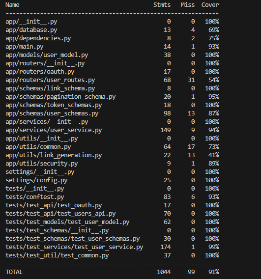

# Event Manager Company: Software QA Analyst/Developer Onboarding Assignment

Welcome to the Event Manager Company! As a newly hired Software QA Analyst/Developer and a graduate student in software engineering, you are embarking on an exciting journey to contribute to our project aimed at developing a secure, robust REST API that supports JWT token-based OAuth2 authentication. This API serves as the backbone of our user management system and will eventually expand to include features for event management and registration.

## Assignment Objectives

1. **Familiarize with REST API functionality and structure**: Gain hands-on experience working with a REST API, understanding its endpoints, request/response formats, and authentication mechanisms.

2. **Implement and refine documentation**: Critically analyze and improve existing documentation based on issues identified in the instructor videos. Ensure that the documentation is up-to-date and accurately reflects the current state of the software.

3. **Engage in manual and automated testing**: Develop comprehensive test cases and leverage automated testing tools like pytest to push the project's test coverage towards 90%. Gain experience with different types of testing, such as unit testing, integration testing, and end-to-end testing.

4. **Explore and debug issues**: Dive deep into the codebase to investigate and resolve issues related to user profile updates and OAuth token generation. Utilize debugging tools, interpret error messages, and trace the flow of execution to identify the root cause of problems.

5. **Collaborate effectively**: Experience the power of collaboration using Git for version control and GitHub for code reviews and issue tracking. Work with issues, branches, create pull requests, and merge code while following best practices.

# Coverage 91%

# links issues 
 1. [Validate minimum and maximum length of full_name](https://github.com/Anneryshc/event_manager_part1/issues/1)
 2. [Add URL validation in profile_picture_url ](https://github.com/Anneryshc/event_manager_part1/issues/3)
 3. [Password validation ](https://github.com/Anneryshc/event_manager_part1/issues/5)
 4. [Missing code/ token schema.py](https://github.com/Anneryshc/event_manager_part1/issues/7)
 5. [Incorrect code in httpd/delete](https://github.com/Anneryshc/event_manager_part1/issues/9)

  ## Extras Issues 
6. [Try complete de pytest-- cov](https://github.com/Anneryshc/event_manager_part1/issues/11)
7. [Documentation](https://github.com/Anneryshc/event_manager_part1/issues/13)

# Reflective summary

Working on this project as a simulated Software Quality Analyst and a graduate student in IT (Information Technology) has been a great experience. The goal was to understand how to create a secure API for managing events. I learned a lot about how APIs work and how to ensure they are secure. Going through existing codes step by step helped me identify errors and find ways to improve them. I used tools like Git, VS, and of course GitHub for this purpose. This helped me improve code quality and work better as a team, considering that the code was already there, and our task was to find solutions to various problems. Solving issues related to password security and other details gave me a realistic view of how work is done in real projects. In the end, this project enhanced my technical skills and attention to detail.
